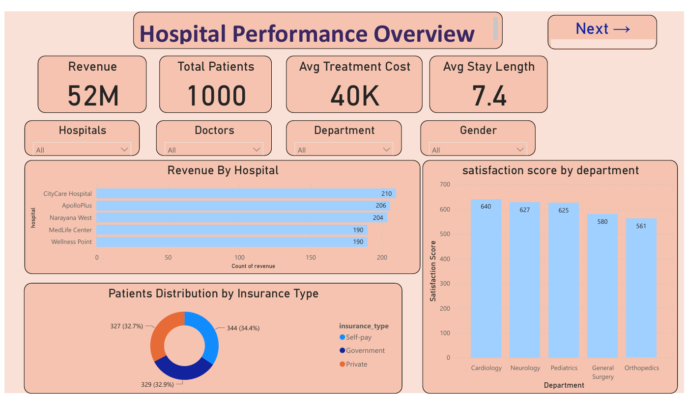

#  Hospital Analytics Dashboard - Power BI + SQL

Welcome to the **Hospital Analytics Dashboard**, a powerful healthcare business intelligence solution designed to deliver actionable insights into hospital operations, patient demographics, departmental performance, doctor readmissions, and monthly trends — all built using **Power BI** and **MySQL**.

---

##  Project Overview

- **Organization:** Simulated Healthcare Network (Multiple hospitals and departments)
- **Goal:** Enable healthcare stakeholders to make informed, data-driven decisions by visualizing KPIs and patient metrics.
- **Problem:** Hospital administrators lacked a consolidated view of operations, leading to inefficiencies in resource allocation, poor patient experience, and unchecked readmission rates.
- **Solution:** Build a unified dashboard that brings together raw hospital data and department metrics into clean, interactive reports.
- **Tools Used:** Power BI, MySQL, DAX, Excel/CSV

---

##  Data Model

- Built using a **Star Schema** with:
  - 1 raw fact table (`Hospital_Raw_Data`)
  - 3 aggregated fact views:
    - `KPI_Summary` (cost, patients, length of stay, revenue)
    - `Department_Performance` (satisfaction, revenue, cost)
    - `Doctor_Readmission_Stats` (readmissions & rate)
  - 3 dimension tables:
    - `Hospital_List`, `Department_List`, `Doctor_List`
- All joins created in SQL before importing to Power BI via CSVs

---

##  Data Sources

- 📄 **MySQL**: Data pre-joined and cleaned using SQL queries
- 📄 **CSV Files**: Output views exported and used in Power BI
- 🧼 Preprocessed in Power Query for renaming, formatting, and relationship building

---

##  Dashboard Views

### 1.  Hospital Performance Overview
- Revenue, Avg Treatment Cost, Total Patients, Avg Stay Length (KPI cards)
- Revenue by Hospital (Bar Chart)
- Satisfaction Score by Department
- Insurance Type Distribution (Donut Chart)
- 

### 2.  Department Performance
- Avg Cost, Revenue, and Satisfaction (Bar Charts)
- Top-performing Departments by various KPIs
- Filterable by Department or Hospital

### 3.  Patient Demographics
- Gender and Age Group Distribution
- Insurance Type by Demographics
- Age Group-wise Hospital Comparisons
- Total Patient Count (Card)

### 4.  Doctor Readmission Analysis
- Readmission Rate vs Doctor (Scatter Plot)
- Total Cases and Readmission Count (Cards)
- Readmission Rate (Line/Bar)
- Doctor-wise Breakdown with Filters

### 5.  Hospital Trends
- Revenue by Month (Line Chart)
- Total Patients by Month
- Avg Length of Stay by Month
- Readmission Breakdown by Month (Stacked Column)
- Month-Year Slicer

---

## 🧠 Business Metrics Used

- Total Revenue
- Avg Treatment Cost
- Total Patients
- Avg Length of Stay
- Satisfaction Score
- Readmission Rate
- Department-wise and Month-wise Trends

---

##  Power BI Features Used

-  DAX for custom measures (e.g., Readmission Rate %, Age Group Buckets)
-  Custom relationships and modeling in Power BI
-  Slicer syncing across pages
-  Interactive navigation buttons (Next →, Home)
-  Report-level filters
-  Clean layout with consistent color themes
-  Scatter plots, combo charts, donut charts, bar charts, and line graphs

---

##  SQL Involvement

- Pre-processed all raw tables in **MySQL**
- Wrote queries to:
  - Join multiple tables using keys (`hospital`, `doctor_name`, `department`)
  - Aggregate metrics for KPI Summary and Departmental views
  - Format readmission metrics and monthly groupings
- Exported query outputs as CSVs for Power BI import

---

## 📷 Screenshots

### 🔹 Hospital Performance Overview

### 🔹 Hospital Trends Dashboard

---

## 🎯 Project Outcome

The Hospital Analytics Dashboard enables healthcare professionals to:
- Understand and reduce patient readmissions
- Track patient demographics and satisfaction
- Improve financial and operational decisions
- Visualize month-wise patterns in patient volume and revenue
- Identify underperforming departments or doctors
- Leverage data instead of assumptions

This project highlights my proficiency in combining **SQL, DAX, Power BI, and data storytelling** to build a complete business analytics solution from scratch.

---

## 💼 Skills Demonstrated

- SQL Joins and Aggregation Queries
- Power BI Data Modeling (Star Schema)
- DAX Measures and Calculated Columns
- Data Cleaning in Power Query
- KPI Design and Dashboard Aesthetics
- Interactive Page Navigation & Slicer Syncing
- Business Metric Interpretation (Readmission %, Revenue, LOS, Satisfaction)

---

## 👤 Created by

**Navya M**  
📍 Data Analyst | Power BI Developer  
📧 mnavya392002@gmail.com  

---

## 📌 Tags

`Power BI` `SQL` `Healthcare Analytics` `Dashboard` `Hospital KPIs` `Data Modeling` `DAX` `Business Intelligence` `Readmission Rate` `Satisfaction Score`

